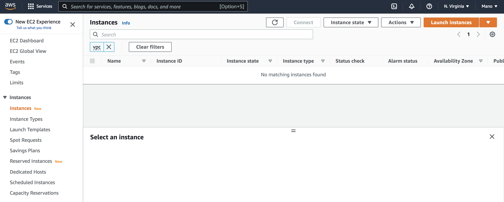
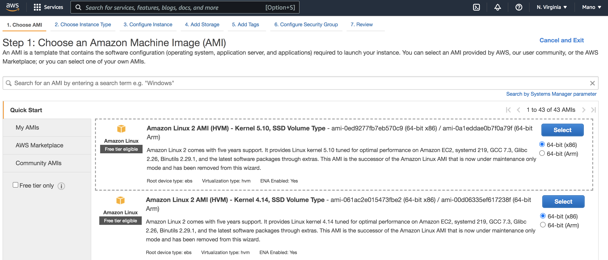
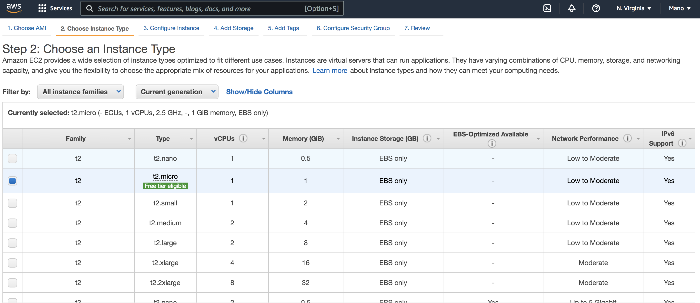
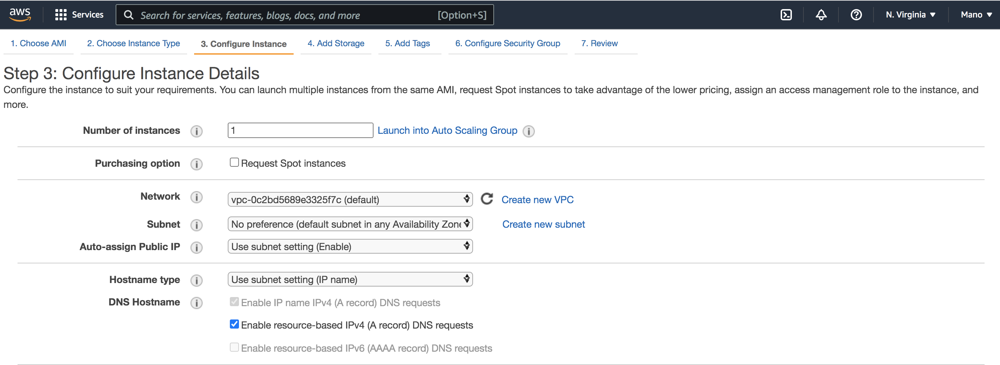

# How to Create Jenkins in EC2
## Jenkins
Jenkins is open-source automated server that lets the developer to build,test and deploy an software application. It is completly written in Java. since it facilitates continuous integration and continuous delivery in software projects ,it lets the developers to know about the errors at an early stage. It integrates with a number of AWS Services, such as AWS CodeCommit, AWS CodeDeploy, Amazon EC2 Spot, and Amazon EC2 Fleet.This page lets you to walk through the process of deploying Jenkins in one of Amazon's webservices called EC2 instance. 

To Start with you must have Amazon Account,If you don't have click [here](https://console.aws.amazon.com/console) 
## Launching Amazon Ec2 Instance
To launch an EC2 instance:
 - Sign in to the the AWS Management Console.
 - Open the Amazon EC2 console by choosing EC2 under Compute from services. 
 - From the Amazon EC2 dashboard, choose Launch Instance.

### Choose an Amazon Machine Image (AMI)
Amazon Machine Image (AMI) is pre-configured template that contains required software packages,application server including Operating sysytem.You can select an AMI provided by AWS, our user community, or the AWS Marketplace; or you can select one of your own AMIs.
 

      
### Choose an Instance Type 
Amazon EC2 provides a wide selection of instance types optimized to fit different use cases. Each instance type includes one or more instance sizes, allowing you to scale your resources to the requirements of your target workload.Available Instance types are

- General Purpose (t-family=tiny/turbo, m-family=main)
- Compute Optimized(c-family=compute)
- Memory Optimized(r-family=Ram, x=xtreme)
- Accelerated Computing(g-family=Graphics)
- Storage Optimized(i-family=IOPS, H=HDD)

###  Configure Instance Details 
Configure the instance to suit your requirements. You can launch multiple instances from the same AMI.

### Choose Storage
we can attach additional EBS volume or instance store here.we don't need any additional volumes now .

## setup jenkins
