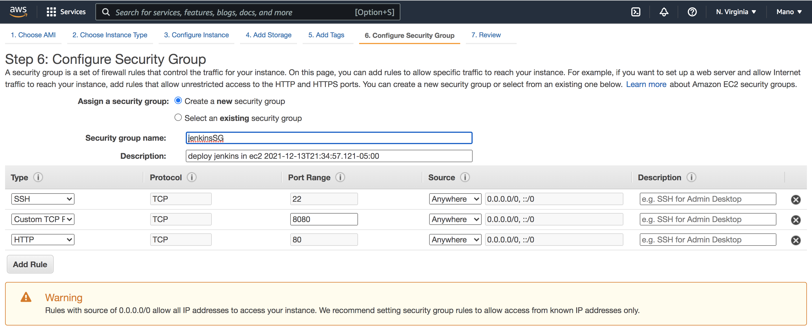
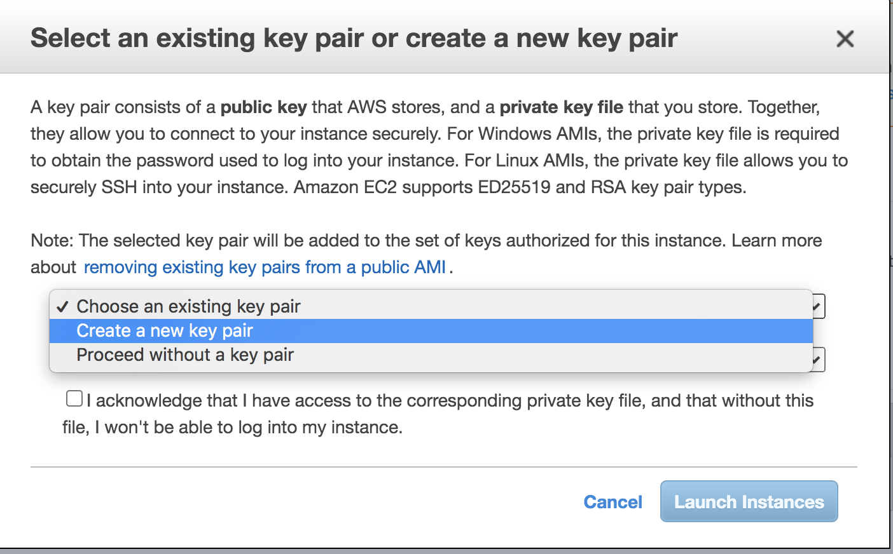
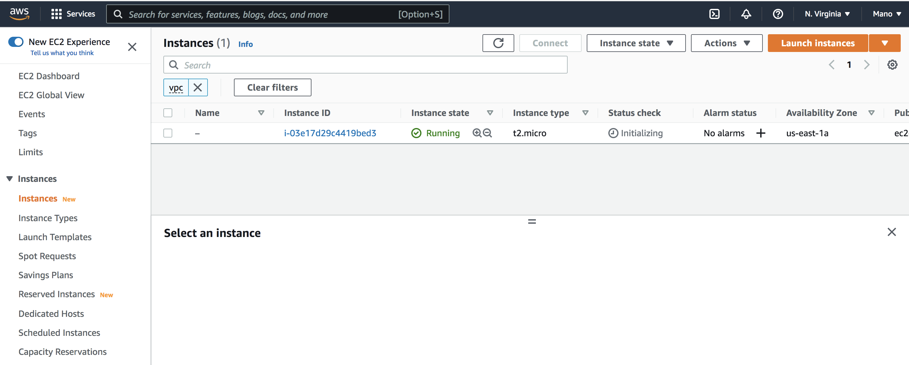
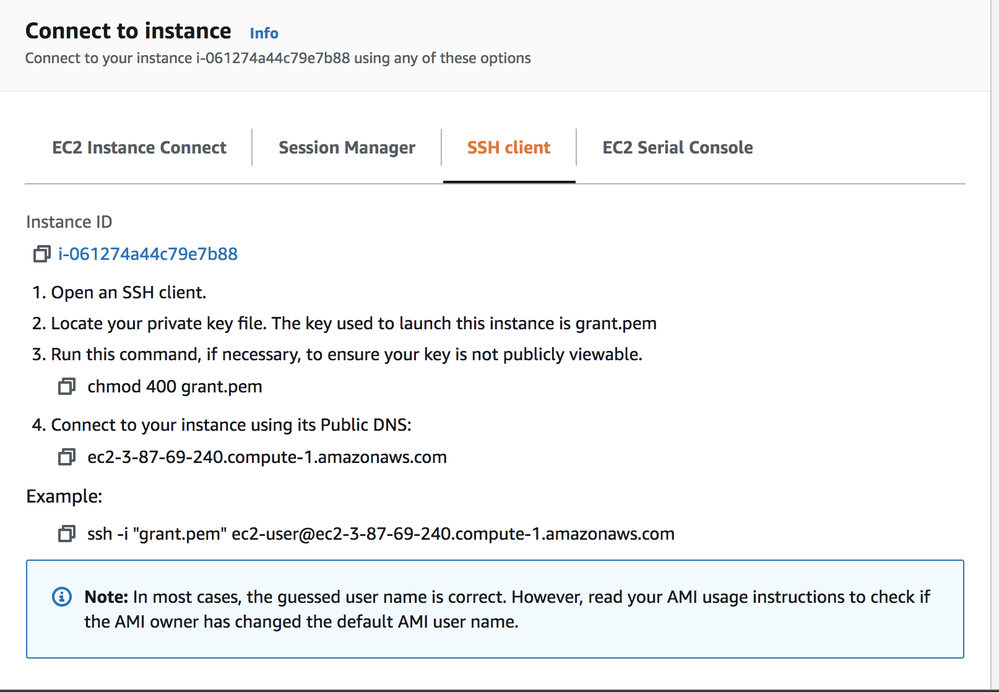
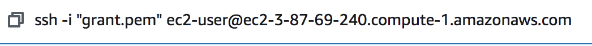
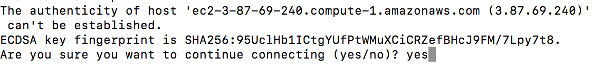
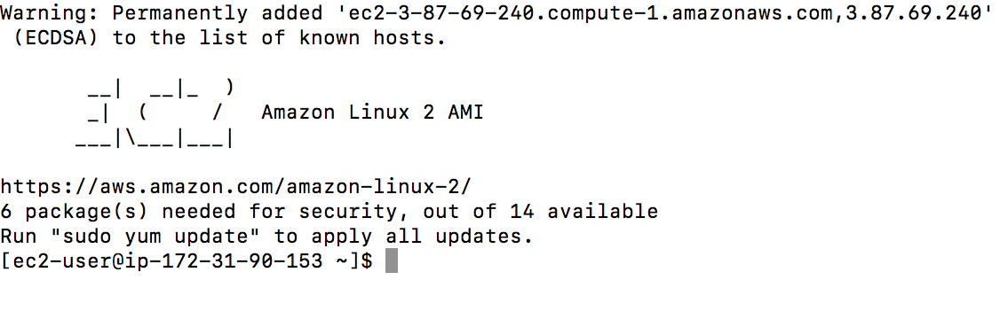
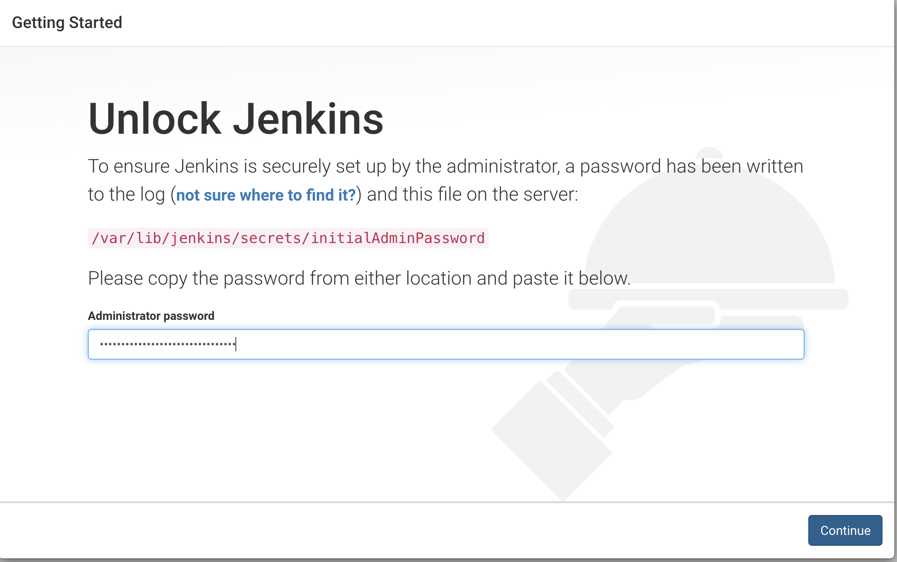
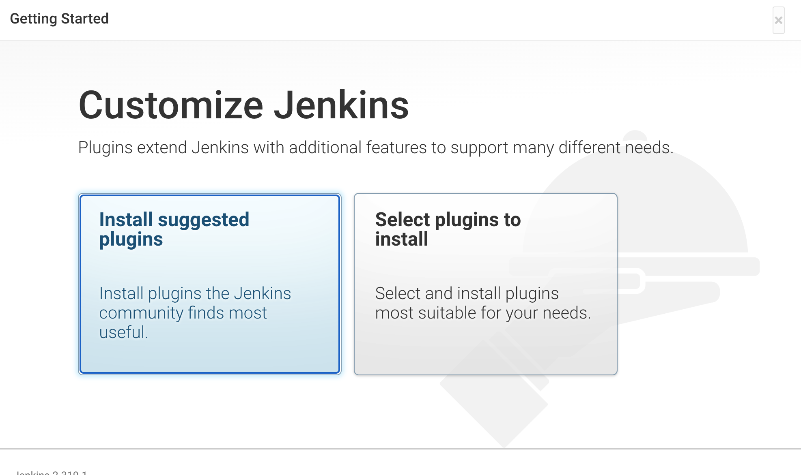

# How to Create Jenkins in EC2
## Jenkins
Jenkins is open-source automated server that lets the developer to build,test and deploy an software application. It is completly written in Java. since it facilitates continuous integration and continuous delivery in software projects ,it lets the developers to know about the errors at an early stage. It integrates with a number of AWS Services, such as AWS CodeCommit, AWS CodeDeploy, Amazon EC2 Spot, and Amazon EC2 Fleet.This page lets you to walk through the process of deploying Jenkins in one of Amazon's webservices called EC2 instance. 

To Start with you must have Amazon Account,If you don't have click [here](https://console.aws.amazon.com/console) 
## Launching Amazon Ec2 Instance
To launch an EC2 instance:
 - Sign in to the the AWS Management Console.
 - Open the Amazon EC2 console by choosing EC2 under Compute from services. 
 - From the Amazon EC2 dashboard, choose Launch Instance.

### Choose an Amazon Machine Image (AMI)
Amazon Machine Image (AMI) is pre-configured template that contains required software packages,application server including Operating sysytem.You can select an AMI provided by AWS, our user community, or the AWS Marketplace; or you can select one of your own AMIs.
 

      
### Choose an Instance Type 
Amazon EC2 provides a wide selection of instance types optimized to fit different use cases. Each instance type includes one or more instance sizes, allowing you to scale your resources to the requirements of your target workload.Available Instance types are

- General Purpose (t-family=tiny/turbo, m-family=main)
- Compute Optimized(c-family=compute)
- Memory Optimized(r-family=Ram, x=xtreme)
- Accelerated Computing(g-family=Graphics)
- Storage Optimized(i-family=IOPS, H=HDD)

###  Configure Instance Details 
Configure the instance to suit your requirements. You can launch multiple instances from the same AMI.If we want to create our own vpc or subnet we can create it here.

### Choose Storage
we can attach additional EBS volume or instance store here.we don't need any additional volumes now .

### Configure Security group
Security group act as a firewall rules that controls the inbound and outbound traffic for our instances.
#### First we add Inbound traffic rules
Since we added Amazon linux we must add rules to a security group to enable you to connect to your Linux instance from your IP address using SSH.SSH is a secure conections for our linux instances.It always communicates with a port 22.
- Click Add Rule, and then choose SSH from the Type list. Under Source, select anywhere to allow all traffic for the specified protocol to reach your instance. 
  This option automatically adds the 0.0.0.0/0 IPv4 CIDR block as the source. This is acceptable for a short time in a test environment, but it's unsafe in           production environments. In production, authorize only a specific IP address or range of addresses to access your instances.

-Click Add Rule, and then choose Custom TCP Rule from the Type list. Under Port Range enter 8080.Under Source, select anywhere.
-Click Add Rule, and then choose Custom HTTP Rule from the Type list.It always communicates with the 80.Under Source, select anywhere.

For OUTBOUND Traffic by dafault it allows allows all the traffic to all the ports to all the destinations.This means it allows traffic to any destinations.If we want we can add rules to specify which traffic to leave from the instance.Let it be default here.
outbound imagege
Click Review and launch
review and launch img
verify here and click Launch.
###Key-Pair
Enter a descriptive name for the key pair. Amazon EC2 associates the public key with the name that you specify as the key name. A key name can include up to 255 ASCII characters. It can’t include leading or trailing spaces.

For File format, choose the format in which to save the private key. To save the private key in a format that can be used with OpenSSH, choose pem. To save the private key in a format that can be used with PuTTY, choose ppk.

Select Create key pair.

The private key file is automatically downloaded by your browser.
The base file name is the name you specified as the name of your key pair, and the file name extension is determined by the file format you chose. 
Save the private key file in a safe place.
This is the only chance for you to save the private key file.
If you will use an SSH client on a macOS or Linux computer to connect to your Linux instance, use the following command to set the permissions of your private key file so that only you can read it.
###### $ chmod 400 <key_pair_name>.pem
If you do not set these permissions, then you cannot connect to your instance using this key pair.

In the left-hand navigation bar, choose Instances to see the status of your instance. Initially, the status of your instance is pending. After the status changes to running, your instance is ready for use.

### Connecting EC2 Instance
After you launch your instance, you can connect to it and use it the way that you would use your local machine.
The tool that you use to connect to your Linux instance depends on the operating system running on your computer. If your computer runs Windows, you will connect using PuTTY. If your computer runs Linux or Mac OS X, you will connect using the SSH client. 

#### Using SSH to connect our instance
Use the ssh command to connect to the instance. You will specify the private key (.pem) file and ec2-user@public_dns_name.

The response will be 

Enter Yes

Yes we are in Linux OS now.we succesfully connected our instance!!
### Download and install Jenkins
To download and install Jenkins
- Add the Jenkins repo using the following command:
[ec2-user ~]$ sudo wget -O /etc/yum.repos.d/jenkins.repo \
    https://pkg.jenkins.io/redhat-stable/jenkins.repo
- Import a key file from Jenkins-CI to enable installation from the package:

[ec2-user ~]$ sudo rpm --import https://pkg.jenkins.io/redhat-stable/jenkins.io.key
- use the following command to perform a quick software update:

[ec2-user ~]$ sudo yum update –y

- Install Jenkins:

[ec2-user ~]$ sudo yum install jenkins java-1.8.0-openjdk-devel -y

Error: Package: jenkins-2.306-1.1.noarch (jenkins)
           Requires: daemonize 
 Run this comment to resolve the above error
 $ sudo amazon-linux-extras install epel
 [ec2-user ~]$ sudo systemctl daemon-reload
 - Start Jenkins as a service:

[ec2-user ~]$ sudo systemctl start jenkins

-You can check the status of the Jenkins service using the command:

[ec2-user ~]$ sudo systemctl status jenkins
####Configure Jenkins
Jenkins is now installed and running on our EC2 instance. To configure Jenkins:

Connect to http://<your_server_public_DNS>:8080 from your favorite browser.
You will be able to access Jenkins through its management interface:

- As prompted, enter the password found in /var/lib/jenkins/secrets/initialAdminPassword.

Use the following command to display this password:

[ec2-user ~]$ sudo cat /var/lib/jenkins/secrets/initialAdminPassword
copy the password and paste it in the above password section.
The Jenkins installation script directs you to the Customize Jenkins page. Click Install suggested plugins.

