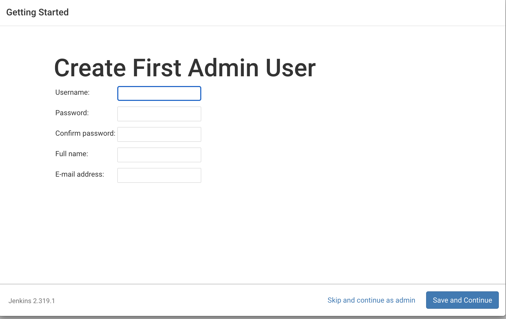
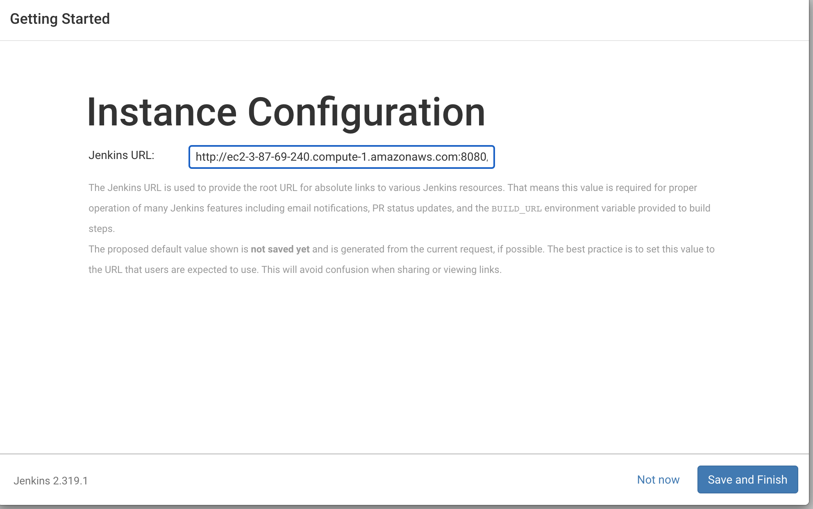
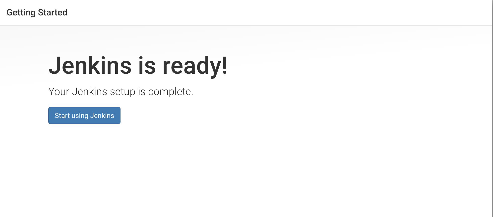

# How to Create Jenkins in EC2
## Jenkins
Jenkins is open-source automated server that lets the developer to build,test and deploy an software application. It is completly written in Java. since it facilitates continuous integration and continuous delivery in software projects ,it lets the developers to know about the errors at an early stage. It integrates with a number of AWS Services, such as AWS CodeCommit, AWS CodeDeploy, Amazon EC2 Spot, and Amazon EC2 Fleet.This page lets you to walk through the process of deploying Jenkins in one of Amazon's webservices called EC2 instance. 

To Start with you must have Amazon Account,If you don't have click [here](https://console.aws.amazon.com/console) 
## Launching Amazon Ec2 Instance
    Detailed instructions to setup is [here](\docs\ec2_setup.md)
### Download and install Jenkins
To download and install Jenkins
- Add the Jenkins repo using the following command: `[ec2-user ~]$ sudo wget -O /etc/yum.repos.d/jenkins.repo https://pkg.jenkins.io/redhat-stable/jenkins.repo`
- Import a key file from Jenkins-CI to enable installation from the package:`[ec2-user ~]$ sudo rpm --import https://pkg.jenkins.io/redhat-stable/jenkins.io.key`
- use the following command to perform a quick software update:`[ec2-user ~]$ sudo yum update –y`

- Install Jenkins:

~~~
[ec2-user ~]$ sudo yum install jenkins java-1.8.0-openjdk-devel -y

Error: Package: jenkins-2.306-1.1.noarch (jenkins)
           Requires: daemonize 
 Run this comment to resolve the above error
 $ sudo amazon-linux-extras install epel
 [ec2-user ~]$ sudo systemctl daemon-reload
 - Start Jenkins as a service:

[ec2-user ~]$ sudo systemctl start jenkins

-You can check the status of the Jenkins service using the command:

[ec2-user ~]$ sudo systemctl status jenkins
~~~
#### Configure Jenkins
Jenkins is now installed and running on our EC2 instance. To configure Jenkins:

Connect to `http://<your_server_public_DNS>:8080` from your favorite browser.
You will be able to access Jenkins through its management interface:

- As prompted, enter the password found in `/var/lib/jenkins/secrets/initialAdminPassword`

Use the following command to display this password:

`[ec2-user ~]$ sudo cat /var/lib/jenkins/secrets/initialAdminPassword`
copy the password and paste it in the above password section.

The Jenkins installation script directs you to the Customize Jenkins page. Click Install suggested plugins.

Once the installation is complete, Create First Admin User, click Save and Continue.

We are now ready to use EC2 instances as Jenkins agents.

#### Delete your EC2 instance
Clean up
After completing this tutorial, be sure to delete the AWS resources that you created so that you do not continue to accrue charges.
In the left-hand navigation bar of the Amazon EC2 console, choose Instances.
Right-click on the instance you created earlier and select Terminate.
