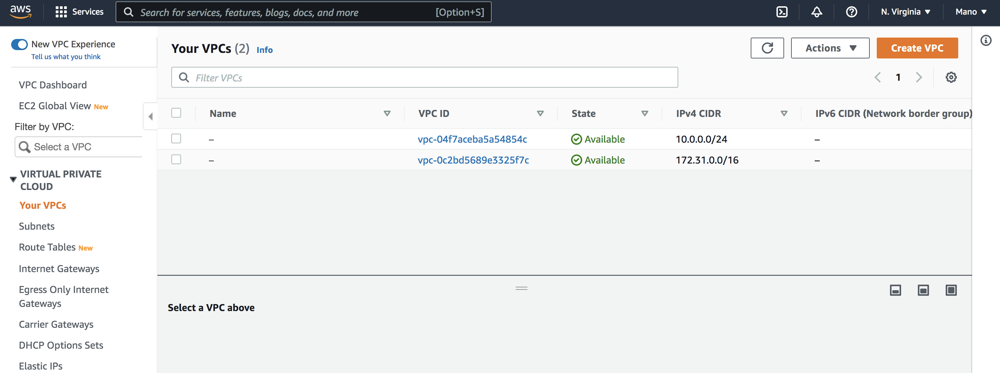

Creating VPC,Subnets,Internet Gateway and NAT gateway

## Creating VPC
VPC- A virtual private cloud (VPC) is a virtual network dedicated to your AWS account. It is logically isolated from other virtual networks in the AWS Cloud.
To create our own vpc
Go to the amazon console
In the search services box  type VPC

Click Your VPC

Click Create VPC

- Name your VPC
- Give CIDR range
## CIDR
Classless Inter-Domain Routing(CIDR) blocks are for specifying a range to IP addresses in format of IPv4 or IPv6.
~~
General format for CIDR Blocks: x.y.z.t/p
- x, y, z and t are numbers from 0 to 255. Basically, each represents an 8 bit binary number. That's why it is range is up to 255. Combination of this numbers becomes an IPv4 IP address that must be unique to be able to identify a specific instance. 
- p is a number from 16 to 28. It represents the number of bits that are inherited from given IP address.
~~
For example: 10.0.0.0/16 represents an IP address in following format: 
10.0.x.y where x and y are any number from 0 to 255. 
So, actually it represents a range of IP addresses, starting from 10.0.0.0 to 10.0.255.255.
However for each CIDR block, AWS prohibits 5 possible IP addresses. Those are the first 4 available addresses and the last available address. In this case:
~~
10.0.0.0: Network address
10.0.0.1: Reserved for VPC router
10.0.0.2: DNS server
10.0.0.3: Reserved for future use
10.0.255.255: Network broadcast 
~~
When you create a VPC, you must specify a range of IPv4 addresses for the VPC in the form of a Classless Inter-Domain Routing (CIDR) block.

How to calculate CIDR 
~~~
suppose the IPV4 CIDR is 10.0.0.0/26
2^(32-26)=2^6=64 
so we have 64 avilable IP addresses.
It starts with 10.0.0.0
Ends with  10.0.0.63
~~~

## Creating Subnets
Sunbnets are Range of IP Addresses.Currently we can create 200 subnets per VPC. If you would like to create more, we have to submit a case at the support center.
subnets can't span across availability zones.
Here we are going to create two private and two public subnets within the IP range of 10.0.0.0/26
we are going to divide the CIDR to 4 equal block for each subnets.so each subnets can have 16 IP address.
On the VPC Dashboard

click subnets
#### Creating first private subnet

In the create subnet wizard choose your VPC

Name the subnet and choose the avilability zone.

Give the IP range for our first subnet
10.0.0.0/28
2^(32-28)
2^(4)=16 IP address for our FIRST PrIVATE SUBNET.
### Creating second private subnet
Repeat the steps above for creating our second subnet.
Here the IP range
10.0.0.16/28
our first subnet range from 0-15.So our second subnet starts with 16 and ends with 32.

### Creating Create First Public subnet
Repeat the steps above for public subnet.
Here the IP range from
10.0.0.32/28

### Creating Second Public subnet
Repeat the steps forsecond  public subnet as before.
Here the IP range from
10.0.0.48/28

## Creating Route Tables
#### Route Table
~~~
- A route table contains a set of rules, called routes, that are used to determine where the data packets of the network traffic are directed.
- Each subnet in your VPC must be associated with a route table. 
- The VPC has a main route table and any subnet by default is associated with it.
- Custom route tables can be defined and associated with one or more subnets.
- Each route in a route table consists of a target and destination. For example – Traffic Destined for 10.0.0.24/28 is Targetted for Internet Gateway (IGW)
- The destinations of route tables are either CIDR blocks or prefix lists (in case of VPC gateway endpoints).
- The targets of route table could be Internet gateways (IGW), NAT gateways, egress-only gateways(EIGW), Elastic Network Interfaces (ENIs),  Virtual Private      Gateways(VGW), VPC gateway endpoints and VPC peers.
~~~
We are now going to have two route tables.one for private subnets and one for public subnets

By default there is a main route table for our vpc.so here we rename it as public-RT for public route table.
Next Create another route table for our private subnets as shown below

~~~After creating the subnets we have to associate the subnets to the route table.

## associate subnets to the route table

## create internet gateway
## Create NAT Gateway
